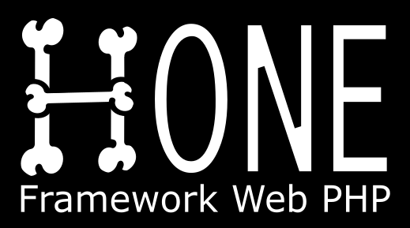
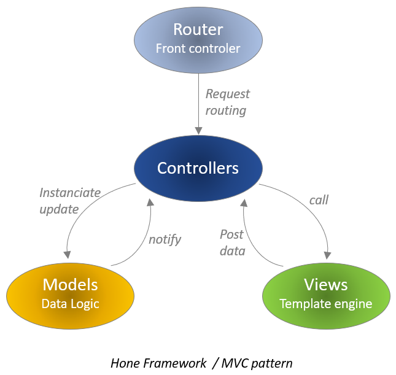
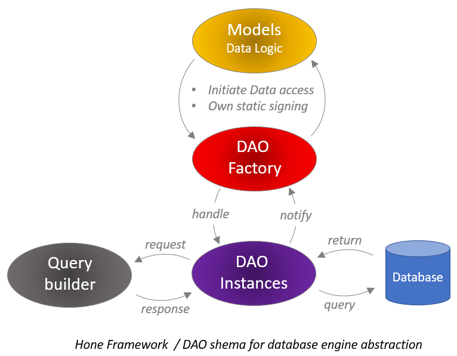
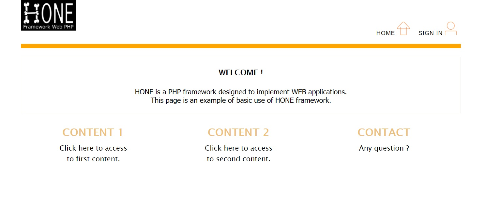
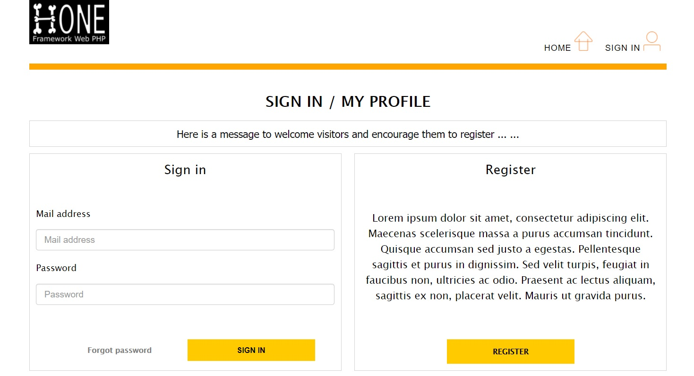

  

 
<i>Hone</i> (say honé literally “Bone” in Japanese) is a PHP framework designed to implement websites or 
web applications. <i>Hone</i> is simple and light, its architecture based on MVC 
(Model / View / Controller) pattern will allow you to organize your code and 
distinguish the roles within your modules.

  

## Database Engine Abstraction

At an architecture level, data access management is based on a DAO pattern that allows 
you to abstract the way data is stored. This abstraction is found at a technical level 
through the use of the PDO extension which also guarantees greater security, in particular 
by preventing malicious SQL injections.  
<i>Hone</i> thus allows you to have greater technical independence from your database engine.

  

## Template engine

The view management block is built around Smarty template engine, whose power and 
ease of use are well established.

## About this repository

The source code available in this repository is a website template. 
A few pages of content and full member management system will allow you to appreciate the 
flexibility and power of the framework. It will be easy for you to adapt this template 
or capitalize on it in order to implement your project.

Here are some screenshots taken from the template website :

 
   
  <i>Screenshot 1 - Hone framework : Template website home page</i>

 

 
   
  <i>Screenshot 2 - Hone framework : Template website login page</i>

 

## Documentation and configuration guide

A documentation made as a tutorial is being written and will be available very soon ...
In the meanwhile feel free to download the framework, test the template and play with it. 
A configuration guide is available in this repository (cf "docs" folder). 
Stay in touch !

## License

The <i>Hone</i> framework is an open-source project. The source code is therefore 
accessible to everyone. This framework integrates some third-party libraries 
(Smarty, PHPMailer, QueryBuilder for example). These libraries have been integrated 
without any modification, most of them are subject to license. 
<i>Hone</i> is therefore released under the GNU Lesser General Public License v3.

## Credits

Author of <i>Hone</i>'s core : 
<a href="https://www.linkedin.com/in/ludovic-changeon-9047141b1/" target="new" rel="noopener noreferrer">
Ludovic CHANGEON </a> 

